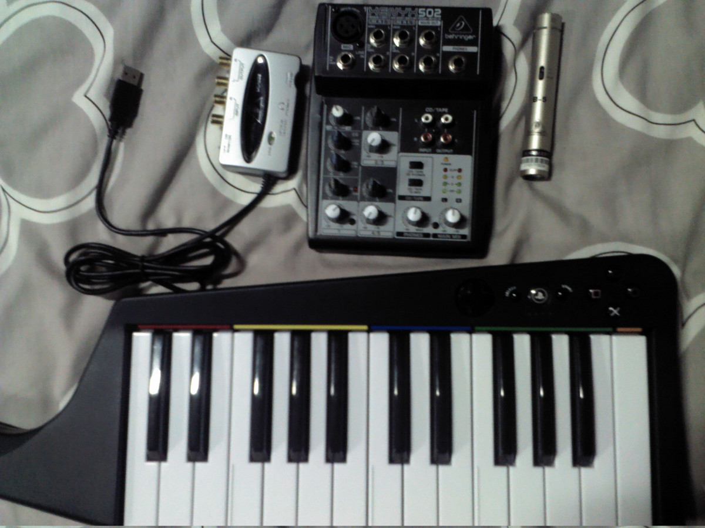
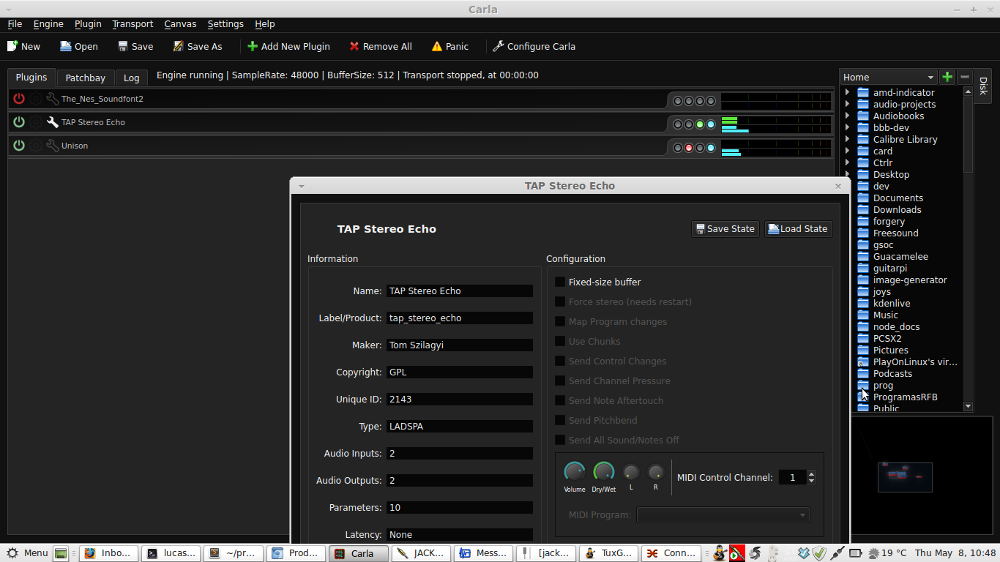
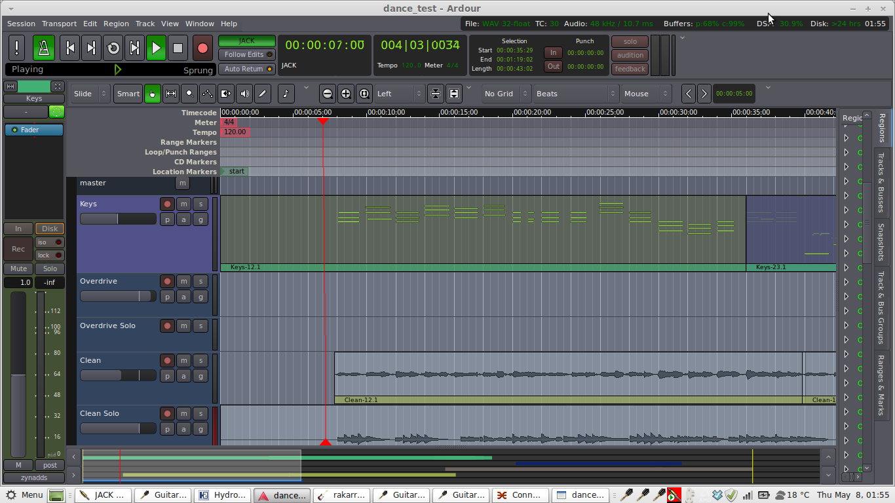
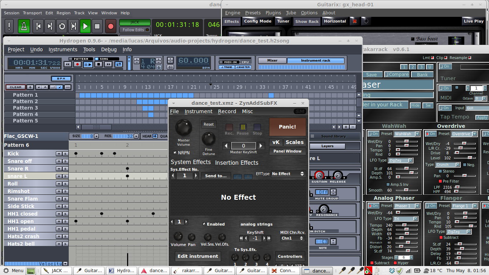

% Produção Musical de Qualidade no Linux
% Lucas Fialho Zawacki

# Quem vos fala?

* Lucas Fialho Zawacki
* Formado em Ciência da Computação pela UFRGS
* Membro do Matehackers (<http://matehackers.org>)
* Trabalhando no [Mconf](http://mconf.org/)

# Contatos

## <http://blog.lfzawacki.com>
## <http://soundcloud.com/lfzawacki>
## @lfzawacki (gmail, twitter, github, ...)

# Como esta palestra vai funcionar:

* Muitos links
* Algumas demonstrações e conversas
* Peguem os slides e explorem

## [bit.ly/linux_musica](http://bit.ly/linux_musica)

# Roteiro:

* Falar um pouco sobre o Linux
* Sobre o hardware necessário
* Demonstrar o software
* Criar algo aqui na hora para vocês

# Linux e Música

## Atitude

Não é requisito, mas se você planeja ser um astro do rock então é melhor desenvolver uma atitude rebelde e  rejeitar resolutamente softwares populares.

    Qtractor User Manual

# Linux e Música

Em minha opinião a situação da música no Linux não é perfeita, mas é muito boa!

* Muitos softwares de qualidade e gratuitos
* Infraestrutura moderna de conexão (Jack) e plugins (LV2)
* Comunidade não muito grande, mas crescendo

# Comunidade

* [linuxmusicians.com](http://linuxmusicians.com/)
* [linux-sound.org](http://linux-sound.org/)
* [opensourcemusician.com](http://opensourcemusician.com/)
* [lists.linuxaudio.org](http://lists.linuxaudio.org/listinfo/)

# Ambiente de Áudio

A situação já foi pior, mas ainda está meio bagunçada. Diversos
"sistemas de áudio" concorrentes e programas que trabalham mais ou menos com cada um deles.

* alsa
* pulseaudio
* oss
* outros...

# Ambiente para Música

No entanto, quando o assunto é produção musical a coisa é mais organizada. Temos
alguns padrões como a arquitetura do [Jack](http://jackaudio.org/) e os plugins [LADSPA](http://www.ladspa.org/) e [LV2](http://lv2plug.in/).

# Ambiente para Música

* Grande variedade de software livre *e gratuito*
* Softwares Inovadores
* Programas usando padrões bem documentados (mesmo que nem sempre open)
  * MIDI, OSC
  * LV2, LADSPA, VST, Soundfonts
  * .flac, .ogg, .mp3, .wav, ...

# Ambiente para a música

## Hardware Livre

[Raspberry Pi pedal de guitarra](https://www.youtube.com/watch?v=zzemdS4s8kk)

# Primeiros passos

## Distro

Suporte de software é muito importante. Qualquer uma mais atualizada e popular serve.

Ubuntu, Mint, Debian, Fedora ...

# Primeiros Passos

## Distros Especializadas

* Muitas, mas muitas mesmo!
* [Ubuntu Studio](http://ubuntustudio.org/): Muito popular
* [KXStudio](http://kxstudio.sourceforge.net/): Parece promissora

# Primeiros passos

## Hardware

Muito importante tomar cuidado ao comprar, pois nem todos são compatíveis.

* [LinuxStudioPro](http://linuxstudiopro.com/)
* [Linux Compatible](http://www.linuxcompatible.org/)
* [Linux Sound](http://linux-sound.org/hardware.html)

# Montado um setup

# Montando um setup

# [Audacity](http://audacity.sourceforge.net/)

* Ótimo e rápido para gravar
* Perfeito para editar clipes de áudio
* Fácil de usar e intuitivo

# O que é o [Jack](http://jackaudio.org/)?

* Roteamento modular de áudio com baixa latência
* Faça o roteamento de som entre diferentes aplicativos
* Escreve/lê e redireciona notas MIDI de softwares e hardwares
* Sincronize o BPM de diferentes aplicações

# Para guitarristas

* [Guitarix](http://guitarix.sourceforge.net/)
* [Rakkarack](http://rakarrack.sourceforge.net/)
* [gx_tuner](http://linuxmusicians.com/viewtopic.php?f=24&t=7251)
* [TuxGuitar](http://sourceforge.net/projects/tuxguitar/)

# Sintetizadores

* [ZynAddSubFX](http://sourceforge.net/projects/zynaddsubfx/)
* [Bristol](http://bristol.sourceforge.net/about.html)
* [QSynth](http://qsynth.sourceforge.net/qsynth-index.html) e outros synths

# Digital Audio Workstations

* Rosegarden
* Muse
* [Ardour](http://ardour.org/)
* [Qtractor](http://qtractor.sourceforge.net/qtractor-index.html)
* e outros ...

# [Ardour](http://ardour.org/)

* Gravação e Importação de Áudio
* Gravação e Reprodução de MIDI
* Boa interface
* Ótimo suporte a plugins 
* Em desenvolvimento ativo

# Plugins

* Reverb, Delay, Phaseshift
* Simulação de válvulas, mesas de gravação
* Sintetizadores ...
* Outras coisas mais malucas

# Plugins

# Um projeto simples

# Um projeto simples

# Referências e mais informações

* [Tutoriais de Música Livre](http://blog.matehackers.org/tutoriais-de-musica-livre/)
* [Linux Musicians](wiki.linuxmusicians.com)
* [Links sobre computação e música](http://lfzawacki.heroku.com/life/show/Computer+Music)